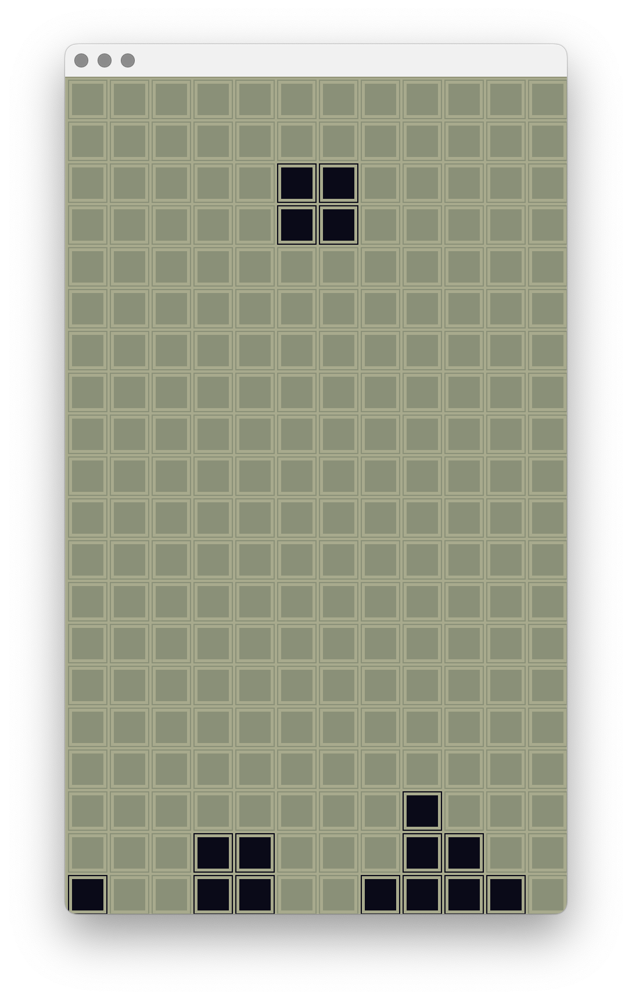
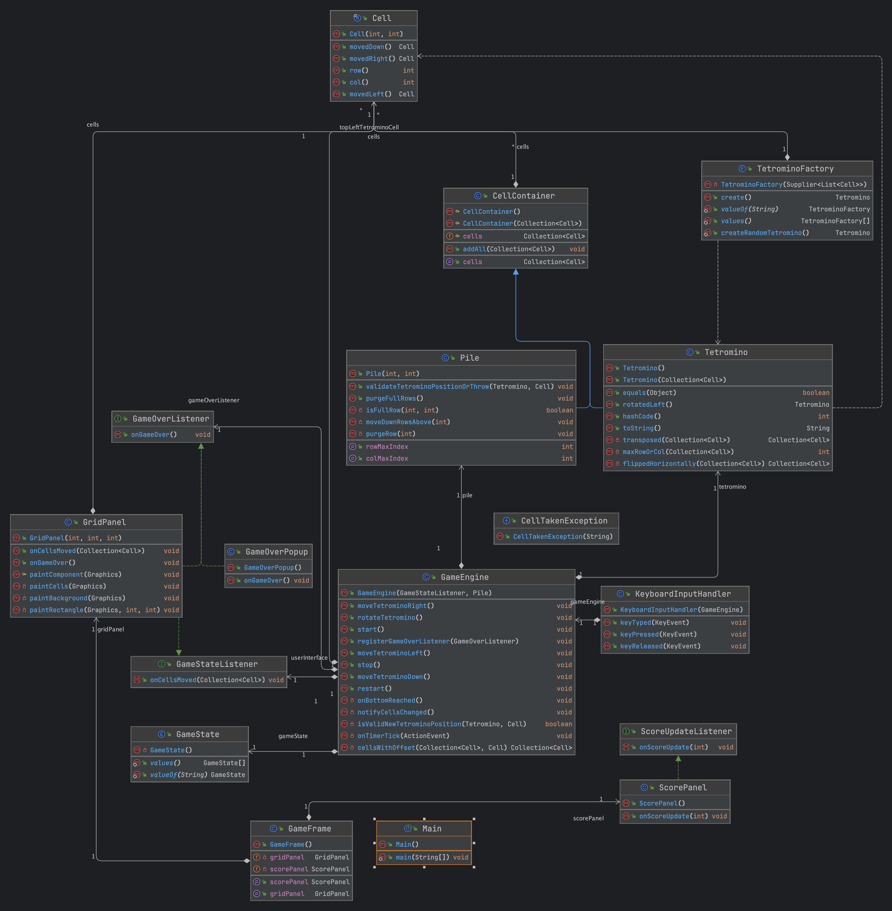

# Swing Tetris

## Example Screenshot
<p align="center">
  
</p>

## About
Swing Tetris is a simple implementation of the classic Tetris game using Java and the Swing library for the user interface. The game includes features such as automatic block falling, user-controlled block movements, line clearing, and a scoring system.

## Features
- Automatic block falling
- Block movements and rotations
- Line clearing and scoring
- Game restart functionality
- Game over detection

## Game Controls
- **Left Arrow:** Move block left
- **Right Arrow:** Move block right
- **Up Arrow:** Rotate block
- **Down Arrow:** Speed up block's fall
- **R:** Restart the game
- **Space** pause/resume the game

## Requirements
- Java Runtime Environment (JRE) version 8 or newer

## Installation and Execution
1. **Clone the repository:**
    ```sh
    git clone <repository_url>
    cd <repository_directory>
    ```
2. **Compile the project:**
     ```sh
     mvn clean install
     ```
3. **Run the application:**
    ```sh
    java -jar target/<Project_name>.jar
    ```
## Class diagram

